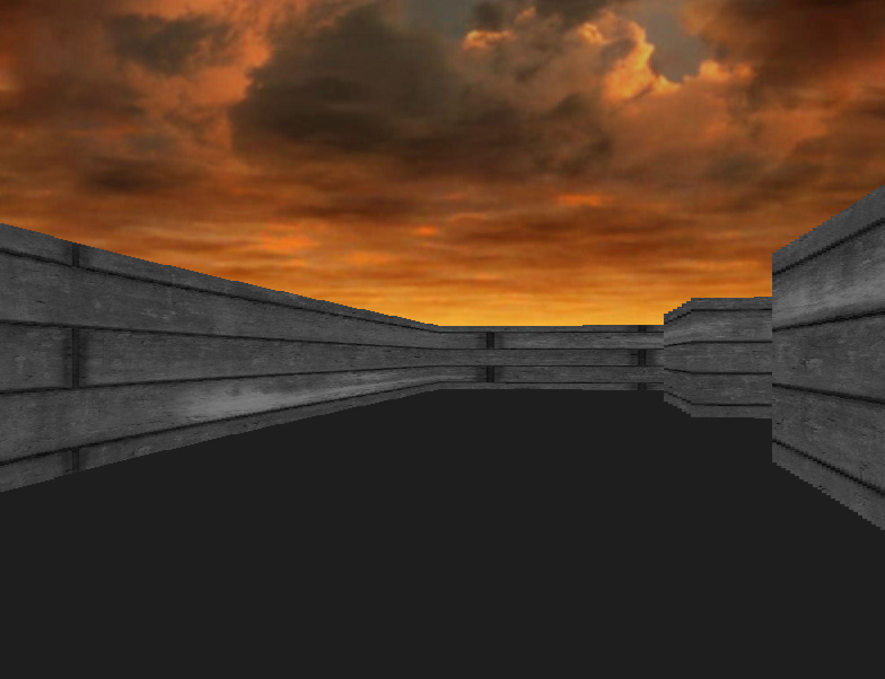

# Small project to learn C++ in a playful way

The main objective is to learn some c++ concept playing with some code.
Additionally using cmake and SMFL to create a simple doom like game.

A simple raycasting and usage of bare bone textures and music is also added.

